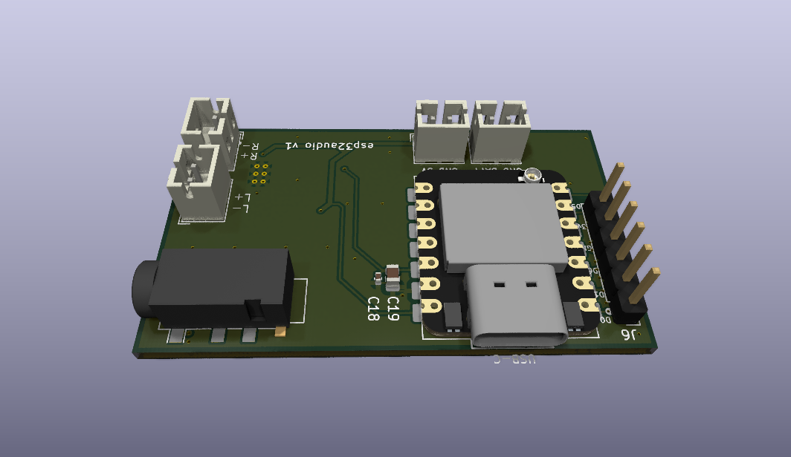
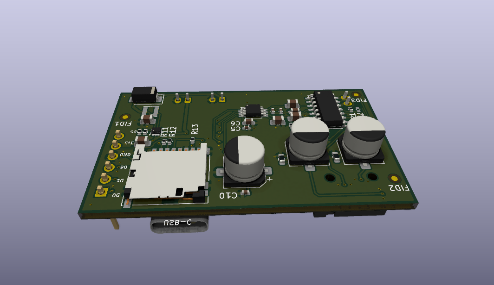

# freeesp32_audioplayer

Open-source ESP32 audio playback board designed primarily as the hardware
platform for [**`freeesp32_ave`**](https://github.com/ppisljar/freeesp32_ave) —
audio-visual entrainment (AVE) firmware.

This repository contains the full **KiCad** project: schematic, PCB layout,
design rules, 3D models, datasheets, and helper scripts.

## Board renders

| Top | Bottom |
|---|---|
|  |  |

*KiCad 3D renders. Top: TRRS headphone jack, USB-C, microSD slot, XIAO ESP32-S3 module, LED/expansion pin headers. Bottom: speaker amplifier (APA2068), bulk capacitors, level-shifting resistors.*

## Board features

- **MCU module**: Seeed Studio **XIAO ESP32-S3** (Wi-Fi + BLE)
- **Headphone output**: Cirrus Logic **CS4344** stereo I²S DAC
- **Speaker output**: **APA2068** Class-D power amplifier
- **Storage**: microSD card slot for offline audio and timeline files
- **LED outputs**: configurable headers — works with NeoPixel (WS2812),
  DotStar (APA102), or direct PWM strips (the firmware picks the backend)

## Repository layout

```
main_board/
├── esp32audio.kicad_sch    # schematic
├── esp32audio.kicad_pcb    # PCB layout
├── esp32audio.kicad_pro    # KiCad project
├── 3dmodels/               # STEP models for enclosure design
├── datasheets/             # IC datasheets and reference schematics
├── analysis/               # generated reports (regenerable from source)
├── images/                 # 3D renders used in this README
├── outputs/                # gerbers, drill files, BOM, pick-and-place CSVs
└── *.py                    # helper scripts (netlist sync, freerouting…)
```

## Related projects

| Repo | Role |
|---|---|
| [`freeesp32_audioplayer`](https://github.com/ppisljar/freeesp32_audioplayer) | **This repo** — open hardware (KiCad) |
| [`freeesp32_ave`](https://github.com/ppisljar/freeesp32_ave) | AVE firmware that runs on this board |
| [`freeesp32_ave_generator`](https://github.com/ppisljar/freeesp32_ave_generator) | Web editor that generates session timelines for the firmware |

## Ordering the board

The `main_board/outputs/` directory contains everything a PCB fab needs:

| File / folder | Purpose |
|---|---|
| `outputs/Archive.zip` | Gerbers + drill file (KiCad standard layer naming) |
| `outputs/esp32audio.csv` | BOM with manufacturer part numbers (MPNs) |
| `outputs/esp32audio-*-pos.csv` | Pick-and-place coordinates (top / bottom / all) |

### PCBWay (recommended for assembly with non-LCSC parts)

1. Go to <https://www.pcbway.com/orderonline.aspx> and upload `outputs/Archive.zip`. The site auto-detects board size, layer count (2-layer), and finish.
2. Defaults are fine: **FR-4, 1.6 mm, HASL or ENIG, green soldermask, white silkscreen**.
3. For assembly: enable **PCB Assembly**, upload `esp32audio.csv` (BOM) and `esp32audio-top-pos.csv` + `esp32audio-bottom-pos.csv` (CPL). PCBWay sources parts by MPN globally — useful if any component is out of stock on LCSC.
4. Quoting + DFM review typically completes within 24 h; bare-board lead time ~3–5 days, assembled ~7–10 days.

### JLCPCB (cheaper for bare boards / parts available on LCSC)

1. Go to <https://cart.jlcpcb.com/quote> and upload `outputs/Archive.zip`.
2. Defaults are fine. JLCPCB's free options match what this design needs.
3. For assembly: enable **PCBA**, upload `esp32audio.csv` (BOM) and `esp32audio-all-pos.csv` (CPL). JLCPCB requires the parts to be in their LCSC catalog — verify MPN availability before ordering, and substitute equivalents in the BOM where needed.

### Bare-board only (any fab)

Just upload `outputs/Archive.zip` — the gerbers use KiCad's standard layer naming (`F_Cu`, `B_Cu`, `F_Mask`, `B_Mask`, `F_Paste`, `B_Paste`, `F_Silkscreen`, `B_Silkscreen`, `Edge_Cuts`) which every modern fab recognises.

### Regenerating outputs from source

If you edit the schematic or PCB, regenerate the manufacturing files from KiCad:

- **PCB → File → Fabrication Outputs → Gerbers…** (use `outputs/` as the output directory, then zip)
- **PCB → File → Fabrication Outputs → Drill Files…**
- **PCB → File → Fabrication Outputs → Component Placement…** (top + bottom CPL)
- **Schematic → Tools → Generate BOM…**

## Status

Hardware design in active development. See `main_board/project_plan.md` and
`main_board/lessons_learned.md` for design notes.

## License

TBD — open hardware license to be chosen (e.g. CERN-OHL-S 2.0).
